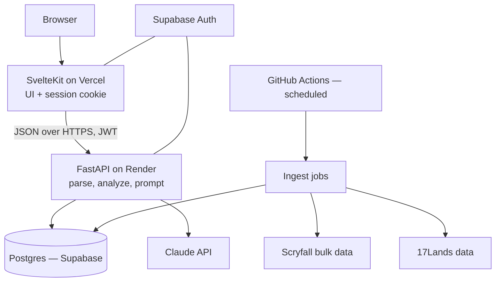

# BoosterTutor — Development Plan

**Version:** 1.0 · **Written:** 2026-08-24 · **Owner:** Jackson

This is the working plan for building BoosterTutor from an empty folder to a live web app. It is written for someone who has not built a web app before, so it errs on the side of explaining *why* as well as *what*. Work through it in order. Each phase ends with a **Done when** checklist — do not move to the next phase until every box is ticked.

Update the **Status** column in the phase table as you go, and update the `Current phase:` line in `CLAUDE.md` at the end of each phase.

---

## 1. What we are building

BoosterTutor is a Magic: the Gathering **Limited** coach. A player gives it something they did — a draft they completed, or a deck they built — and it tells them, specifically and honestly, where they went wrong and why.

### Two features

**Draft Review.** The user supplies a 17Lands draft (a draft ID/URL, or a pasted log). The app walks all 45 picks and returns a short blurb per pick: was this pick right, what was the strongest alternative, and what signal did the pack send about what was open.

**Deck Review.** The user supplies a deck plus sideboard (pulled from a 17Lands draft, or typed/pasted as text). The app critiques the build — curve, colors, land count, creature/removal balance, archetype coherence — and proposes specific swaps between maindeck and sideboard.

### Explicit non-goals for v1

Naming these now stops scope creep later.

- **No live draft assistant.** No MTGA log watching, no real-time pick suggestions during a draft. That is a desktop-overlay problem, not a web-app problem.
- **No Constructed.** Limited only.
- **No cube, no Chaos draft, no custom sets.** Only sets 17Lands publishes data for.
- **No social layer.** No comments, follows, or public feeds. Saved history is private to the user.
- **No payments.** If costs become a problem, we gate usage with rate limits, not billing.

### Who it is for

A Limited player who plays on Arena, uses 17Lands already, and wants a second opinion that is more patient than a friend and better-informed than their own memory.

---

## 2. The single most important design decision

**The language model does not do arithmetic, and it does not remember card statistics. Python does that. The model only explains.**

This is the difference between an app people trust and an app people catch lying. If you ask Claude "was Pick 3 of Pack 1 correct?" and hand it a raw draft log, it will confidently invent win rates, misremember what was in the pack, and give advice that sounds authoritative and is wrong.

So the pipeline is always:

```
raw input → parse → enrich from our database → compute deterministic facts in Python → hand a compact, factual brief to Claude → Claude writes the prose → structured JSON back → render
```

Every number that appears in the final output — a win rate, a pick order average, a curve count, a color-pair record — comes out of our Postgres database and is passed *into* the prompt. Claude's job is judgment, synthesis, and phrasing over facts we supply. Nothing else.

Practical rule you will apply many times: **before adding anything to the prompt, ask whether Python could have computed it instead.** If yes, compute it.

---

## 3. Architecture



### The pieces and why each was chosen

| Layer | Choice | Why |
|---|---|---|
| Frontend | SvelteKit + TypeScript + Tailwind | You already picked Svelte; it has the least ceremony of the major frameworks, which matters when you are learning. TypeScript catches an entire category of bug before you run the code. Tailwind means you never leave the component file to style it. |
| Backend | Python 3.12 + FastAPI | You chose Python, and it is the right call here: the data work (17Lands CSVs, aggregation, stats) is miserable in TypeScript and pleasant in pandas. FastAPI gives you typed request/response models via Pydantic and free interactive API docs at `/docs`. |
| Database | Postgres, hosted on Supabase | Relational data with real joins. Supabase gives you Postgres *and* authentication in one free project, which removes a whole subsystem you would otherwise have to build. |
| Auth | Supabase Auth (email + Google) | You wanted accounts and saved history. Rolling your own auth is the classic beginner trap — password hashing, session fixation, reset-token expiry, email deliverability. Use a provider. |
| ORM / migrations | SQLAlchemy 2.0 + Alembic | The standard. Alembic gives you versioned schema changes so your database and your code never drift apart. |
| LLM | Claude API — `claude-sonnet-5` primary, `claude-haiku-4-5-20251001` for cheap paths | Sonnet 5 is the speed/capability sweet spot at $2/$10 per million tokens in/out. Haiku 4.5 ($1/$5) for simple classification jobs. |
| Frontend hosting | Vercel | First-class SvelteKit support, deploys on `git push`, free tier is fine. |
| Backend hosting | Render | Simplest Git-connected Python hosting. Note the free tier sleeps after inactivity — a cold start adds ~30–50s to the first request. Budget ~$7/month for the paid tier before you show it to anyone. |
| Scheduled jobs | GitHub Actions cron | Free, version-controlled alongside the code, no extra service to run. Ingestion is a nightly batch job, not a long-running worker. |

### Why a separate backend at all?

SvelteKit can run server code, so a fair question is why not do everything there. Three reasons: the ingestion and analysis code is Python; keeping the Claude API key and the database credentials in a service the browser can never reach is a cleaner security boundary; and a standalone API means you could later build a mobile client or a Discord bot without rewriting the brain.

The cost is that you now deploy two things and have to think about CORS and authentication between them. That is a fair trade, and Phase 1 gets both deployed on day one so it never becomes scary.

---

## 4. Repository layout

One repository, two applications. This is a "monorepo" and it is the right choice at this size — one clone, one issue tracker, one place where a change to the API and its consumer land in the same commit.

```
BoosterTutor/
├── CLAUDE.md
├── README.md
├── .gitignore
├── .env.example              # committed; documents required vars with fake values
├── docs/
│   ├── development_plan.md   # this file
│   ├── decisions/            # ADRs — one short file per big decision
│   └── prompts/              # prompt templates, versioned
├── api/                      # FastAPI backend
│   ├── pyproject.toml
│   ├── uv.lock
│   ├── alembic.ini
│   ├── migrations/
│   ├── src/boostertutor/
│   │   ├── main.py           # FastAPI app, routers, CORS
│   │   ├── config.py         # settings via pydantic-settings
│   │   ├── db.py             # engine, session
│   │   ├── models/           # SQLAlchemy tables
│   │   ├── schemas/          # Pydantic request/response models
│   │   ├── routers/          # /drafts, /decks, /cards, /health
│   │   ├── parsing/          # draft log + decklist parsers  (pure, no I/O)
│   │   ├── analysis/         # deterministic metrics          (pure, no I/O)
│   │   ├── llm/              # Claude client, prompt builders, JSON schemas
│   │   └── ingest/           # scryfall.py, seventeen_lands.py
│   └── tests/
│       ├── fixtures/         # real draft logs + decklists, anonymized
│       └── ...
├── web/                      # SvelteKit frontend
│   ├── package.json
│   ├── svelte.config.js
│   ├── src/
│   │   ├── routes/
│   │   ├── lib/
│   │   │   ├── api.ts        # typed fetch wrapper for the FastAPI backend
│   │   │   └── components/
│   │   └── app.css
│   └── tests/
└── .github/workflows/
    ├── ci.yml                # lint + test on every PR
    └── ingest.yml            # nightly data refresh
```

**Rule to internalize now:** everything in `parsing/` and `analysis/` is *pure* — functions that take data and return data, touching no network, no database, no clock. Pure code is trivially testable, and these are the two modules where a subtle bug silently produces confident nonsense.

---

## 5. Phase overview

| # | Phase | Est. effort | Status |
|---|---|---|---|
| 0 | Environment, accounts, and Git | 1–2 sessions | Not started |
| 1 | Walking skeleton, deployed | 2–3 sessions | Not started |
| 2 | Data layer: schema + ingestion | 4–6 sessions | Not started |
| 3 | Parsers and the analysis engine | 4–6 sessions | Not started |
| 4 | The LLM layer | 3–4 sessions | Not started |
| 5 | Draft Review, end to end | 4–5 sessions | Not started |
| 6 | Deck Review, end to end | 3–4 sessions | Not started |
| 7 | Accounts and saved history | 3–4 sessions | Not started |
| 8 | Hardening | 3–4 sessions | Not started |
| 9 | Launch | 2–3 sessions | Not started |

A "session" is a focused 2–3 hour block. Expect the early phases to take longer than estimated and the later ones to go faster than you fear.

---

## Phase 0 — Environment, accounts, and Git (COMPLETE)

Goal: a machine that can build and ship software, and a repository on GitHub with your first commit in it.

### 0.1 Install the toolchain

Open **PowerShell** (press Start, type "PowerShell", Enter) and run these one at a time. `winget` is Windows' built-in package manager; it downloads and installs without you hunting for installers.

```powershell
winget install --id Git.Git -e
winget install --id OpenJS.NodeJS.LTS -e
winget install --id astral-sh.uv -e
winget install --id Microsoft.VisualStudioCode -e
```

**Close PowerShell and open a new one** (installers change your `PATH`, and only new shells see it). Verify:

```powershell
git --version      # expect 2.4x or newer
node --version     # expect v22.x or v24.x
npm --version
uv --version
```

If any command is "not recognized", the `PATH` did not update — restart your computer and check again before troubleshooting anything else.

**What `uv` is:** the modern Python project manager. It installs Python itself, creates the virtual environment, resolves dependencies, and locks them, replacing the older `python -m venv` + `pip` + `requirements.txt` dance. Install the Python it will use:

```powershell
uv python install 3.12
```

### 0.2 Configure Git

Git records who made each change, so tell it who you are:

```powershell
git config --global user.name "Jackson Owen"
git config --global user.email "jackowen@gmail.com"
git config --global init.defaultBranch main
git config --global core.autocrlf true
git config --global pull.rebase true
```

`core.autocrlf true` handles the Windows/Unix line-ending difference so your diffs are not full of phantom changes. `pull.rebase true` keeps your history linear instead of littered with "Merge branch 'main'" commits.

### 0.3 Accounts to create

Do all of these now so nothing blocks you mid-phase. Use the same email for each.

1. **GitHub** — github.com. This is where your code lives and where CI runs.
2. **Anthropic Console** — console.anthropic.com. Create an API key, and **set a monthly spend limit** (start at $20) under Billing → Limits. Copy the key somewhere safe; the console will not show it again.
3. **Supabase** — supabase.com. Create a project named `boostertutor`. Save the database connection string, the project URL, the `anon` key, and the `service_role` key. The `service_role` key bypasses all security rules and must *only* ever exist on the backend.
4. **Vercel** — vercel.com. Sign in with GitHub.
5. **Render** — render.com. Sign in with GitHub.
6. **Domain** — buy `boostertutor.dev` (Cloudflare Registrar or Namecheap; `.dev` runs about $15/year). `.dev` domains are HTTPS-only by browser mandate, which is a small free security win.

### 0.4 Create the repository

On GitHub, create a new **private** repository named `BoosterTutor`. Do not let it add a README, `.gitignore`, or license — you already have a folder with `CLAUDE.md` in it, and starting empty avoids a merge conflict on your very first push.

Then, in PowerShell:

```powershell
cd C:\Users\jacko\Claude\Projects\BoosterTutor
git init
```

Create `.gitignore` in the project root with this content:

```gitignore
# secrets — never commit these
.env
.env.local
.env.*.local
*.pem

# python
__pycache__/
*.py[cod]
.venv/
.pytest_cache/
.ruff_cache/
.mypy_cache/

# node
node_modules/
.svelte-kit/
build/
.vercel/

# data + os
data/raw/
*.csv.gz
.DS_Store
Thumbs.db
```

Then make the first commit and push:

```powershell
git add .
git commit -m "chore: initial commit with project docs"
git branch -M main
git remote add origin https://github.com/<your-username>/BoosterTutor.git
git push -u origin main
```

Git will open a browser window to authenticate the first time. That is Git Credential Manager; let it do its thing.

### 0.5 Learn the four Git commands that matter

You do not need to understand Git deeply yet. You need this loop, which you will run dozens of times per phase:

```powershell
git checkout -b feat/short-description   # start work on a branch
# ... make changes ...
git status                               # what did I change?
git add -A                               # stage everything
git commit -m "feat: add the thing"      # save a checkpoint
git push -u origin feat/short-description
```

Then open a Pull Request on GitHub, let CI run, and merge it. **`main` must always be deployable.** Every change reaches `main` through a branch and a PR, even when you are the only person on the project — because the PR is what triggers your tests, and because the diff view catches mistakes your editor hides.

Commit messages use [Conventional Commits](https://www.conventionalcommits.org): `feat:`, `fix:`, `chore:`, `docs:`, `test:`, `refactor:`. Small commits, often. A commit that says "stuff" is a commit you cannot revert with confidence six weeks later.

### 0.6 Set up VS Code

Open the project folder in VS Code (`code .` from the project directory) and install these extensions: **Svelte for VS Code**, **Python**, **Ruff**, **Tailwind CSS IntelliSense**, **ESLint**, **Prettier**.

### Done when

- [ ] `git --version`, `node --version`, `uv --version` all print versions in a fresh shell
- [ ] All six accounts exist; keys are saved somewhere you will find them again
- [ ] A spend limit is set on the Anthropic account
- [ ] `main` on GitHub contains `CLAUDE.md`, `.gitignore`, and `docs/development_plan.md`
- [ ] You can open the folder in VS Code with the extensions installed

---

## Phase 1 — Walking skeleton, deployed (COMPLETE)

Goal: the thinnest possible version of the real system — browser → SvelteKit → FastAPI → Postgres — running on the real internet at your real domain. No features. Just proof that the pipes connect.

This is deliberately first. Deployment problems are the most demoralizing kind to hit at the end of a project, when you have a working app and cannot ship it. Hitting them on day one, when there is nothing to break, is much cheaper.

### 1.1 Backend skeleton

```powershell
cd C:\Users\jacko\Claude\Projects\BoosterTutor
mkdir api
cd api
uv init --python 3.12
uv add fastapi "uvicorn[standard]" pydantic-settings sqlalchemy psycopg[binary] alembic httpx anthropic
uv add --dev pytest pytest-asyncio ruff mypy
```

Write `api/src/boostertutor/main.py` with a single endpoint that returns `{"status": "ok"}` at `/health`, plus CORS middleware allowing your Vercel origin and `http://localhost:5173`. Run it:

```powershell
uv run uvicorn boostertutor.main:app --reload --port 8000
```

Visit `http://localhost:8000/health` and `http://localhost:8000/docs`. That second URL is FastAPI's auto-generated interactive API documentation — you will use it constantly to poke at endpoints without writing a frontend first.

### 1.2 Frontend skeleton

```powershell
cd C:\Users\jacko\Claude\Projects\BoosterTutor
npx sv create web
```

Choose: **SvelteKit minimal**, **TypeScript**, and add **Prettier**, **ESLint**, **Vitest**, and **Tailwind CSS** when prompted. Then:

```powershell
cd web
npm install
npm run dev
```

Build one page that calls the backend's `/health` and displays the result. Put the backend URL in `web/.env` as `PUBLIC_API_URL=http://localhost:8000` and read it via `$env/static/public`.

**The naming rule that will bite you otherwise:** in SvelteKit, environment variables prefixed `PUBLIC_` are sent to the browser. Everything else stays on the server. Never prefix a secret with `PUBLIC_`.

### 1.3 Connect the database

Add your Supabase connection string to `api/.env` as `DATABASE_URL`. Use the **session pooler** connection string (port 5432 style, labeled "Session" in the Supabase dashboard) — serverless-friendly poolers matter later. Load it with `pydantic-settings` in `config.py`, and add a `/health/db` endpoint that runs `SELECT 1` and reports success.

Create `api/.env.example` with the same keys and fake values, and commit *that* file. It is how future-you remembers what configuration the app needs.

### 1.4 Deploy both halves

**Backend on Render:** New → Web Service → connect the repo → root directory `api` → build command `uv sync --frozen` → start command `uv run uvicorn boostertutor.main:app --host 0.0.0.0 --port $PORT`. Add `DATABASE_URL` and `ANTHROPIC_API_KEY` as environment variables in the Render dashboard. Never in the code.

**Frontend on Vercel:** New Project → import the repo → root directory `web` → framework preset SvelteKit. Install `@sveltejs/adapter-vercel` and set it in `svelte.config.js`. Add `PUBLIC_API_URL` pointing at your Render URL.

**Domain:** point `boostertutor.dev` at Vercel (they give you the DNS records), and `api.boostertutor.dev` at Render. Update CORS on the backend to allow the real frontend origin.

### 1.5 Continuous integration

Create `.github/workflows/ci.yml` that, on every pull request, runs `ruff check`, `mypy`, and `pytest` in `api/`, and `npm run lint`, `npm run check`, and `npm run test` in `web/`. Then, in GitHub repo Settings → Branches, add a rule protecting `main`: require a pull request, and require the CI check to pass.

You now cannot merge broken code into `main` by accident. This is worth the twenty minutes.

### Done when

- [ ] `https://boostertutor.dev` loads and shows a live `ok` fetched from `https://api.boostertutor.dev/health`
- [ ] `/health/db` returns success against Supabase
- [ ] A pull request runs CI and cannot be merged while failing
- [ ] No secret appears anywhere in the Git history (check with `git log -p | Select-String "sk-ant"`)

---

## Phase 2 — Data layer: schema and ingestion

Goal: a Postgres database that knows every card in every draftable set, and how those cards actually perform, refreshed nightly without you touching anything.

This is the phase that makes the advice *true*. Take your time here.

### 2.1 The schema

Write these as SQLAlchemy models in `api/src/boostertutor/models/`, then generate a migration with `uv run alembic revision --autogenerate -m "initial schema"` and apply it with `uv run alembic upgrade head`.

**Card identity**

- `cards` — one row per Oracle card. `oracle_id` (UUID, primary key), `name`, `mana_cost`, `cmc`, `type_line`, `oracle_text`, `colors`, `color_identity`, `power`, `toughness`, `keywords`, `layout`, `scryfall_uri`.
- `card_prints` — one row per printing. `scryfall_id` (PK), `oracle_id` (FK), `set_code`, `collector_number`, `rarity`, `image_uri_normal`, `image_uri_art_crop`. Rarity lives here, not on `cards`, because a card can be uncommon in one set and rare in another — and in Limited, rarity is not a footnote, it is half the context.
- `sets` — `set_code` (PK), `name`, `released_at`, `set_type`, `is_draftable`, `formats_available`.

**Performance data**

- `card_draft_stats` — the core table. Primary key on (`set_code`, `format`, `oracle_id`, `snapshot_date`). Columns: `seen_count`, `alsa` (average last seen at), `pick_count`, `ata` (average taken at), `gp_wr` (games played win rate), `oh_wr` (opening hand), `gd_wr` (drawn), `gih_wr` (games in hand — **the headline number**), `gnd_wr` (not drawn), `iwd` (improvement when drawn), `game_count`.
- `card_archetype_stats` — the synergy layer. Primary key on (`set_code`, `format`, `oracle_id`, `deck_colors`, `snapshot_date`). Same win-rate columns, but scoped to a two-colour archetype. This is what lets the app say "this card is mediocre overall but it is one of the best commons in Boros" instead of collapsing everything to one number.
- `archetype_stats` — per color pair: `set_code`, `format`, `deck_colors`, `wins`, `games`, `win_rate`, `snapshot_date`. The format-level meta.

**Why `snapshot_date` is in every key:** win rates move a lot in the first two weeks of a set and then settle. Keeping snapshots means you can serve "current" data, explain a set as it looked when the user drafted it, and debug "why did the advice change?" A view called `card_draft_stats_current` selecting the latest snapshot per card keeps query code simple.

**Application data** (schema detailed in Phase 5–7, listed here for completeness): `users`, `drafts`, `draft_reviews`, `decks`, `deck_reviews`, `review_jobs`.

### 2.2 Scryfall ingestion

Scryfall publishes bulk data files, updated roughly every 12 hours. Do **not** crawl card-by-card.

The job in `ingest/scryfall.py`:

1. `GET https://api.scryfall.com/bulk-data` — a small JSON index listing available files.
2. Find the entry with `type == "default_cards"` and take its `download_uri`. Default Cards (~460 MB) includes every printing, which you need for set-specific rarity and images. Oracle Cards (~150 MB) is one row per card and is enough if you later decide printings do not matter — they do, so use Default.
3. Stream-parse it. It is too big to load into memory comfortably; use `ijson` to iterate objects, or download to `data/raw/` and read incrementally.
4. Filter to paper/Arena sets you care about, then `INSERT ... ON CONFLICT DO UPDATE` (upsert) into `cards`, `card_prints`, and `sets`.
5. Record the file's `updated_at` so you can skip work when nothing has changed.

**Etiquette Scryfall asks for and you should honour:** identify your client with a descriptive `User-Agent` (e.g. `BoosterTutor/1.0 (jackowen@gmail.com)`), and if you ever *do* hit their per-card endpoints, insert 50–100 ms between requests. Card images and data are used under their guidelines; attribution goes in your footer (see Phase 9).

Cadence: weekly, plus manually the day a new set drops.

### 2.3 17Lands ingestion

17Lands is the harder and more important source, and it needs care — both technically and as a matter of not being a bad citizen.

**Two ways in, and you should build both.**

*Path A — the aggregate endpoints the website itself calls.* The card ratings and color ratings pages on 17lands.com fetch JSON from their own backend. These endpoints are **not a documented public API**. They are not promised to be stable, and their exact paths and parameters need to be confirmed by you, not taken from memory or from a blog post.

How to confirm them, which is a genuinely useful skill: open 17lands.com/card_ratings in Chrome, press F12, go to the **Network** tab, filter to **Fetch/XHR**, change the set or format dropdown, and watch the request that fires. Right-click it → Copy → Copy as cURL. That is the exact URL, query parameters, and headers. Write down what you find in `docs/decisions/0002-17lands-data-access.md`, including the date you checked, because it may change.

Rules for using it, non-negotiable:

- One request per (set, format, color-filter) per day, maximum. Cache everything in Postgres; never call it from a user request path.
- Set a `User-Agent` that names the project and your email, so they can contact you instead of blocking you.
- Back off exponentially on any non-200, and never retry in a tight loop.
- Read their FAQ and terms before you go live, and email them to ask if what you are doing is acceptable. 17Lands is a free community resource run by people who did not sign up to serve your traffic. Ask first; it costs one email and it is the difference between a partner and a leech.
- Handle failure gracefully: if the fetch fails, the app serves yesterday's snapshot and logs a warning. It must never show the user a broken page because an upstream source hiccupped.

*Path B — the public datasets.* 17Lands publishes aggregated, anonymized datasets as gzipped CSVs on S3, in the shape `https://17lands-public.s3.amazonaws.com/analysis_data/game_data/game_data_public.{SET}.{FORMAT}.csv.gz` (and a corresponding `draft_data_public.*` for pick-level data). These are large — hundreds of thousands of rows, and the game files have well over a thousand columns because there is a column per card per zone.

This is your authoritative fallback and your source for anything the aggregate endpoints do not expose. Process it *offline*, not on a schedule:

```python
# sketch — read in chunks, never load the whole thing
import pandas as pd
for chunk in pd.read_csv(url, compression="gzip", chunksize=50_000):
    ...  # accumulate counts, then compute rates at the end
```

Compute your own GIH WR and archetype numbers from it, and **check them against Path A**. If your independently-computed number matches 17Lands' published number for the same set, both your ingestion and your understanding are correct. If it does not, one of them is wrong and you need to know which before you ship advice built on it.

Get the definitions right, because they are the vocabulary of the whole app:

- **ALSA** — Average Last Seen At. How late the card wheels; low means it goes early.
- **ATA** — Average Taken At. Where drafters actually pick it.
- **GIH WR** — win rate of games where the card was in hand at some point. The single best card-quality signal 17Lands publishes.
- **IWD** — Improvement When Drawn. GIH WR minus the win rate of games where it was in the deck but not drawn. Isolates the card's own contribution from the deck's.
- **Sample size matters.** A 62% GIH WR over 180 games is noise. Store the game counts and refuse to make claims below a threshold (start at 500 games for card-level, 200 for archetype-scoped) — surface it as "not enough data" instead of pretending.

### 2.4 Scheduling

`.github/workflows/ingest.yml`, on a `schedule:` cron (pick an off-peak hour, e.g. `0 9 * * *` = 2am Pacific), plus `workflow_dispatch:` so you can trigger it by hand. It checks out the repo, installs with `uv sync`, and runs the ingest commands with `DATABASE_URL` from GitHub repository secrets.

Log a row into an `ingest_runs` table for each job: source, started/finished timestamps, rows written, status, error. When advice looks wrong in three months, that table is how you find out the data went stale.

### Done when

- [ ] `alembic upgrade head` builds the schema from scratch on an empty database
- [ ] `cards` and `card_prints` are populated for at least the three most recent draftable sets
- [ ] `card_draft_stats`, `card_archetype_stats`, and `archetype_stats` are populated for the current set
- [ ] Your independently-computed GIH WR from the public dataset matches 17Lands' published figure for a spot-check of five cards
- [ ] The nightly Action has run successfully at least once on its own schedule
- [ ] `docs/decisions/0002-17lands-data-access.md` records exactly what you are calling and when you verified it

---

## Phase 3 — Parsers and the analysis engine

Goal: given a raw draft log or decklist, produce a rich, entirely factual structured summary — with no LLM involved at all.

If you build this well, Phase 4 is easy. If you skip ahead to the LLM first, you will spend weeks trying to prompt your way out of a data problem.

### 3.1 Input formats

Support these, in this order:

**Draft Review inputs**

1. **17Lands draft ID or URL** — the user pastes a link to their draft. You extract the ID and fetch the pick-by-pick data. Confirm what is publicly retrievable using the same Network-tab method from 2.3, and confirm whether the draft's owner must have made it public. Design the UI to fail clearly ("that draft is private or not found") rather than mysteriously.
2. **Pasted MTGA draft log** — the section of Arena's `Player.log` covering a draft. Text, parseable, no network needed. Build this one first: it is fully under your control and makes a perfect test fixture.
3. **MTGO draft log text** — the classic `--------Pack 1 pick 1:--------` format. Cheap to add once the canonical model exists.

**Deck Review inputs**

1. **Pasted decklist** — MTGA export format (`4 Lightning Bolt (M21) 159`), plus plain `1 Card Name`, with a `Deck` / `Sideboard` separator. Be forgiving: strip set codes, handle `//` double-faced names, handle the `SB:` prefix, ignore blank lines.
2. **A deck attached to a 17Lands draft ID** — reuse the draft fetcher.

### 3.2 The canonical model

Every input format converts into one internal shape, and everything downstream only ever sees this shape. Define it with Pydantic in `schemas/`:

```python
class Pick(BaseModel):
    pack_number: int          # 1-3
    pick_number: int          # 1-15
    pack_cards: list[UUID]    # oracle_ids available in this pack
    picked: UUID
    pool_before: list[UUID]   # everything already drafted

class DraftLog(BaseModel):
    set_code: str
    event_type: str           # PremierDraft, TradDraft, QuickDraft
    drafted_at: datetime | None
    picks: list[Pick]         # length 45 for a standard draft
```

Adding a fourth input format later means writing one function that returns `DraftLog`. Nothing else changes. That is the whole point.

### 3.3 The deterministic analysis — Draft

This is the intellectual core of the product. For each of the 45 picks, compute:

**Card quality in context**
- GIH WR of the card taken, and of every other card in the pack, from `card_draft_stats`.
- The **delta**: how much win rate was left on the table versus the pack's best card.
- The same numbers filtered to the archetype the pool is trending toward, from `card_archetype_stats` — because the raw best card is frequently not the best card *for this deck*.
- Rarity and whether a bomb (say, top-5 GIH WR in the set) was passed.

**Pool state at this moment**
- Running color commitment: for each color, count playables already taken, weighted so that early picks and higher-quality cards count more. A "commitment score" per color pair.
- Curve so far, creature count, removal count.
- Whether the pick was on-color, a splash, a pivot, or a speculative first-pick-of-a-pack.

**Signal reading**
- **Wheel analysis:** for pack 1 picks 1–7, you know what was in the pack when it came back around at picks 9–15. Which cards wheeled? A high-GIH-WR card wheeling is a loud signal that its color is open. This is a genuinely strong piece of coaching that Python can compute exactly and that a language model could never infer on its own.
- **Lateness of good cards:** compare each card's position in the pack against its ALSA. A card appearing much later than its ALSA means that colour is flowing.

**Verdict, computed not generated.** Classify each pick against thresholds you define — for example: delta ≤ 0.5pp = `optimal`; 0.5–2pp = `defensible`; 2–4pp = `questionable`; > 4pp = `mistake`. Then adjust for context: taking a slightly worse card that is strongly on-colour when you are already committed is *correct*, and your rules should say so. Write these rules down in `docs/decisions/0003-pick-grading.md`, tune them against drafts you know well, and keep them in Python. The model will *explain* the verdict; it will not decide it.

### 3.4 The deterministic analysis — Deck

- **Curve** — count by CMC, land count, and comparison against format norms for that set (derivable from the public dataset: what do winning decks in this format actually look like?).
- **Colors** — pip counts per color versus land counts per color; flag a splash with insufficient fixing.
- **Composition** — creature count, removal count, card-draw count, finishers. Tag cards by oracle text patterns (`"destroy target creature"`, `"deals N damage to"`, `"draw a card"`) into a `card_tags` table computed at ingest time, so this is a join and not a regex run at request time.
- **Card quality** — average GIH WR of the 23 maindeck spells, and of the deck in its detected archetype.
- **Swap candidates** — the highest-value computation in Deck Review. For each sideboard card, if its archetype-scoped GIH WR exceeds that of a maindeck card in the same colors, and swapping does not wreck the curve or the creature count, it is a candidate. Rank by win-rate delta. Cap at the top five and let the model argue for or against each with the deck's actual context in view.
- **Archetype detection** — color pair plus signpost uncommons plus the tag profile, checked against `archetype_stats` for that set.

### 3.5 Testing

This module is where correctness is invisible until it is embarrassing, so:

- Save 5–10 real draft logs and decklists as fixtures in `tests/fixtures/`. Include ugly ones: a three-color mess, a draft where you know you punted, an empty sideboard, a card with a `//` name.
- Golden-file tests: parse a fixture, serialize the analysis to JSON, compare against a committed expected output. When you change the analysis deliberately, the diff shows you exactly what moved.
- Property tests for the parsers: any valid log produces exactly 45 picks, every `picked` card is in its own `pack_cards`, and `pool_before` grows by exactly one each pick.
- One hand-worked example: pick a single pick, compute the numbers yourself with a calculator and the 17Lands website open, and assert your code produces them.

### Done when

- [ ] All three draft input formats and both decklist formats parse into the canonical models
- [ ] `analyze_draft(DraftLog) -> DraftAnalysis` returns full metrics for all 45 picks with no network calls beyond the database
- [ ] Wheel analysis correctly identifies which cards wheeled in a fixture you verified by hand
- [ ] Golden-file tests pass; `pytest` runs green in CI
- [ ] Not one line of LLM code exists yet

---

## Phase 4 — The LLM layer

Goal: a module that takes a `DraftAnalysis` or `DeckAnalysis` and returns structured, well-written coaching — reliably, cheaply, and testably.

### 4.1 The shape of a call

Three parts, in this order, and the order matters for cost:

1. **System prompt** — the coach's persona, the Limited principles it reasons from, the vocabulary (GIH WR, ALSA, IWD, "on-colour", "signal", "wheel"), and the rules of engagement: *use only the numbers provided; never invent a statistic; if data is missing say so.* This is static, so mark it for **prompt caching** (`cache_control: {"type": "ephemeral"}`) and you stop paying full price for it on every request.
2. **Format primer** — a compact per-set brief: the archetypes and their win rates, the top commons, the format's speed. Generated by Python from `archetype_stats`, changes daily at most, so it caches too.
3. **The brief** — the compact JSON of computed facts for *this* draft or deck. The only part that varies per request.

### 4.2 Batching the 45 picks

Do not make 45 API calls. That is 45× the fixed prompt overhead, 45 round trips, and a review that takes a minute and a half.

**One call per pack — three calls, run concurrently.** Each gets the system prompt (cached), the format primer (cached), the pool state entering that pack, and the 15 pick briefs. The model sees a whole pack's arc at once, which is exactly the context needed to say "you were right to take the removal here, but that means pick 6 should have been the pivot." Then a fourth, small call summarizes the draft as a whole — biggest mistake, best pick, one lesson to carry into the next draft.

Return JSON, and enforce it with a schema rather than hoping. The reliable way is **tool use**: define a tool whose input schema is your desired output shape, and let the model "call" it. Check the current API docs for a first-class structured-output option on your model and prefer it if available. Either way, validate the response against a Pydantic model and retry once on a validation failure.

Target output per pick: a `verdict` (echoing the verdict Python computed, so the prose and the label can never disagree), 1–3 sentences of blurb, an optional `better_pick` oracle_id, and an optional `principle` tag (`signal-reading`, `curve`, `colour-commitment`, `card-quality`, `speculation`).

### 4.3 Making the writing good

Most of the quality difference between a boring coach and one people come back to is in the prompt, and it comes from three things:

- **Concrete over generic.** Ban sentences that would be true of any pick. "This is a solid playable" is worthless. "Taking the 2-drop over the removal spell here cost about 3 points of win rate, and the removal wheeling at pick 12 proved black was open" is coaching.
- **Vary the shape.** Forty-five paragraphs of identical structure read like a spreadsheet. Instruct explicitly: most picks get one sentence, only genuinely interesting ones get three, and obvious picks can be acknowledged in six words.
- **Honest, not harsh, not soft.** A mistake should be named as a mistake, with the reason. Give it two or three few-shot examples in the system prompt showing the exact register you want — this does more than any amount of adjectives about tone.

### 4.4 Cost control

Rough arithmetic at Sonnet 5 pricing ($2 per million input, $10 per million output), assuming ~30k input tokens and ~3k output tokens for a full 45-pick review:

- **Draft Review: roughly $0.05–$0.15 per review**
- **Deck Review: roughly $0.02–$0.05 per review**

Cheap individually, real in aggregate — a hundred reviews a day is somewhere around $10/day. Controls, in order of importance:

1. **Cache reviews.** Hash `(input, prompt_version, data_snapshot_date)`. Identical request, identical answer, zero cost. Draft IDs are re-submitted more than you would guess.
2. **Prompt caching** on the system prompt and format primer — a large fraction of your input tokens are the same every time.
3. **Rate limit per user** — e.g. 10 reviews per day for signed-in users, 2 for anonymous. Enforce in the backend, not the UI.
4. **Model routing** — Haiku 4.5 for the cheap structured jobs (deck archetype classification, card-name fuzzy resolution). Sonnet 5 for the actual coaching.
5. **The Batch API** (50% discount, asynchronous) for anything not user-facing, such as regenerating every stored review after a prompt change.
6. **Log every call** — model, input tokens, output tokens, computed cost, latency, endpoint — into an `llm_calls` table. You cannot control a cost you cannot see.

### 4.5 Evaluating quality

Prompts regress silently. Build a small harness now:

- Ten fixture picks you have graded yourself, including three obvious mistakes and two "looks wrong but is actually right" cases.
- A script that runs the current prompt over them and asserts: the flagged mistakes are flagged, no statistic appears that is not in the input brief, JSON validates, and blurbs stay under the length cap.
- Version prompts as files in `docs/prompts/` (`draft_review.v1.md`), store the version on every saved review, and never edit a prompt in place — create the next version.

The "no invented statistic" check is the important one and it is mechanically testable: extract every number from the output and assert each appears in the input brief.

### Done when

- [ ] A full 45-pick review returns validated JSON in under ~20 seconds
- [ ] Prompt caching is on and visible in the usage numbers
- [ ] The eval harness passes, including the invented-statistic check
- [ ] `llm_calls` records cost per request; you can state your cost per review from data

---

## Phase 5 — Draft Review, end to end

Goal: the feature, live.

### 5.1 Backend

- `POST /api/drafts` — accepts `{source: "17lands_id" | "log_text", value: str}`. Validates, parses, and returns a `draft_id` plus a `job_id`.
- Because a review takes 10–20 seconds, run it **asynchronously**: create a `review_jobs` row with status `pending`, kick off the work in a FastAPI `BackgroundTask`, and return immediately.
- `GET /api/drafts/{id}` — returns the draft with its review, or the job status if still running.
- The frontend polls every 1.5 seconds. Polling is unfashionable and completely adequate here; do not build websockets for this.
- Cache on input hash before doing any work.

### 5.2 Frontend

The page is a vertical timeline of 45 picks grouped into three packs. For each pick: the card taken, the notable alternatives with their win rates, the verdict as a colored chip, and the blurb. Card images from Scryfall URLs stored in `card_prints`, lazy-loaded — 45 picks × 14 cards is a lot of images if you are careless, so show the pack contents only on expand.

Above the timeline, a summary: final record if known, the archetype landed in, the count of picks by verdict, and the model's overall takeaway.

Details that make it feel finished: a skeleton loading state with real progress ("analyzing pack 2 of 3"), keyboard navigation between picks, a shareable read-only URL, and a clear empty/error state for a private or malformed draft.

### 5.3 Verification

Run your own drafts through it — ones where you already know what you did wrong. If it does not surface the mistake you know you made, the analysis engine is wrong, not the prompt. Fix it upstream.

### Done when

- [ ] Paste a 17Lands draft link, get a full review within ~20s, on the live site
- [ ] Pasted MTGA log text works identically
- [ ] Every number shown traces back to the database
- [ ] Errors are handled: bad input, private draft, unsupported set, upstream failure
- [ ] It works on a phone

---

## Phase 6 — Deck Review, end to end

Goal: the second feature, reusing most of the first.

- `POST /api/decks` — accepts a decklist text blob or a 17Lands draft ID. Card-name resolution needs to be forgiving: exact match, then case-insensitive, then fuzzy (`rapidfuzz`) against the set's card list, then front-face for `//` names. Anything unresolved comes back as a structured error naming the exact lines, with suggestions — never a silent drop, and never a review built on a card you guessed at.
- Response: overall assessment, curve chart data, color/mana analysis, ranked swap suggestions with reasoning, and the archetype fit.
- Frontend: a decklist textarea with live parse feedback as you type, a curve bar chart, the mana/pip breakdown, and swap suggestions as before/after card pairs with the win-rate delta and the model's argument for each.
- Let a Draft Review link straight to a Deck Review of the pool it produced. That connection — "here is how you drafted, and here is what you should have built from it" — is the thing that makes the two features one product rather than two tools sharing a domain.

### Done when

- [ ] Both input paths work; unresolved card names produce clear, line-specific errors
- [ ] Swap suggestions are computed in Python and merely explained by the model
- [ ] A finished Draft Review links to a Deck Review of that pool

---

## Phase 7 — Accounts and saved history

Goal: sign in, and your reviews are still there tomorrow.

- **Supabase Auth** with email magic-link and Google OAuth. Use `@supabase/ssr` in SvelteKit so the session lives in an HTTP-only cookie and is available in `+layout.server.ts` and in `hooks.server.ts`.
- SvelteKit passes the Supabase **JWT** to the FastAPI backend as a `Authorization: Bearer <token>` header. FastAPI verifies it against Supabase's JWKS (`python-jose` or `pyjwt` with the JWKS URL) and extracts the user ID. **Verify the signature on the backend.** A user ID sent in a request body, or a token that is decoded without verification, is not authentication — it is an invitation.
- Schema: `users` (mirrors the Supabase auth user with app-specific fields), and `user_id` foreign keys on `drafts`, `decks`, and their reviews, nullable so anonymous reviews still work.
- Authorization: every read of a saved review checks ownership, unless the review has been explicitly shared. Write this check once, in a dependency, and use it everywhere — this is the single most common place a hobby app leaks other people's data.
- History page: list of past reviews with set, date, archetype, and record; filterable by set.
- Anonymous-to-signed-in migration: if someone runs a review then signs up, claim the review by the session ID stored in a cookie.

### Done when

- [ ] Sign up, sign in, sign out all work on the live domain
- [ ] Reviews persist and appear in history
- [ ] Requesting another user's review by ID returns 404, verified by a test
- [ ] Anonymous reviews still work without an account

---

## Phase 8 — Hardening

Goal: it does not fall over, and when it does you find out before your users tell you.

- **Rate limiting** — `slowapi` on the backend, keyed by user ID or IP. Protect the LLM endpoints especially.
- **Input limits** — cap decklist and log text size. Reject early, with a clear message.
- **Error handling** — every external call (Scryfall, 17Lands, Claude, Postgres) wrapped with timeouts, one bounded retry, and a fallback. The user sees a plain-language message, never a stack trace.
- **Observability** — structured JSON logging with a request ID threaded through; **Sentry** on both frontend and backend (free tier is plenty); a `/health` endpoint that checks the database and the data freshness. Alert if the nightly ingest fails twice.
- **Cost alerting** — a daily job that sums `llm_calls` and emails you if it exceeds a threshold.
- **Testing** — unit tests for parsing and analysis (the important ones), API tests with `httpx.AsyncClient`, one Playwright end-to-end test covering paste-log → see-review, and the eval harness in CI.
- **Accessibility** — keyboard navigation, alt text on card images (the card name), colour-contrast on verdict chips, and verdicts that are not distinguished *only* by colour. A meaningful share of Magic players are colourblind; a red-vs-green grading scheme is a poor choice in this of all hobbies.
- **Performance** — database indexes on every foreign key and on `(set_code, format, oracle_id)`; `EXPLAIN ANALYZE` your slowest query; lazy-load images; check a real Lighthouse score.
- **Security pass** — no secrets in the repo (add `gitleaks` to CI), CORS restricted to your own origins, `service_role` key only on the backend, dependencies updated via Dependabot.

### Done when

- [ ] Sentry catches a deliberately-thrown test error from both apps
- [ ] Rate limits return 429 with a helpful message
- [ ] `gitleaks` passes in CI
- [ ] Playwright E2E test passes in CI
- [ ] You can answer "how much did yesterday cost?" in one query

---

## Phase 9 — Launch

- **Legal and attribution — do this before anyone else sees it.**
  - **Wizards of the Coast Fan Content Policy.** BoosterTutor is unofficial fan content. You must not use Wizards' logos or trademarks as your own branding, must not imply endorsement, and should carry the required disclaimer in your footer. Read the current policy at company.wizards.com/fancontentpolicy and follow it exactly.
  - **Scryfall attribution** — credit Scryfall for card data and images in the footer, per their guidelines, and do not imply they endorse you.
  - **17Lands attribution** — credit them prominently and link to them. They are the reason the advice is any good.
  - **Privacy policy and terms** — you are storing accounts and user-submitted data. A short, honest page stating what you collect and why is required in most jurisdictions and takes an hour.
- **Analytics** — something privacy-respecting (Plausible, Umami). Track: reviews started, reviews completed, sign-ups, errors. Do not log decklists into a third-party analytics tool.
- **Feedback** — a thumbs up/down on each blurb, stored with the review ID and prompt version. This is your highest-value dataset: it tells you which prompt version actually coaches better, and it costs almost nothing to collect.
- **Soft launch** — five friends who draft. Watch them use it without helping. Fix what confuses them. Then post to r/lrcast, the 17Lands Discord, and the MTG Limited community — with a clear note that it is unofficial and that you built it on their data with thanks.

### Done when

- [ ] Live on `boostertutor.dev` with attribution, disclaimer, privacy policy, and terms
- [ ] Feedback capture is working
- [ ] Five real users have completed a review and you have watched at least two of them do it

---

## Appendix A — Prompt sketch (Draft Review)

```
SYSTEM  (cached)
You are a Limited coach. You review completed drafts pick by pick.

Rules:
- Use ONLY the statistics provided in the brief. Never state a number
  that does not appear there. If a statistic is missing, say so plainly.
- The verdict for each pick has already been computed. Explain it; do not
  overturn it.
- Be concrete. Reference the specific cards, the specific numbers, and
  what the pack signalled. Never write a sentence that would be true of
  any pick.
- Most picks get one sentence. Only genuinely interesting picks get three.
- Name mistakes as mistakes, with the reason. Do not soften; do not sneer.

Vocabulary: GIH WR (win rate with the card in hand), ALSA (average last
seen at), IWD (improvement when drawn), wheeling (a card returning in the
second half of a pack), signal (evidence a colour is open).

[2-3 few-shot examples of ideal blurbs]

USER  (per pack)
{format_primer}      # archetypes + win rates + top commons for this set
{pool_state}         # colour commitment, curve, creature/removal counts
{picks}              # 15 picks: pack contents with GIH WR, ALSA, rarity;
                     # card taken; delta to best; wheel data; verdict
```

## Appendix B — Ballpark costs

| Item | Monthly |
|---|---|
| Domain `.dev` | ~$1.25 (amortized) |
| Vercel (hobby) | $0 |
| Render (starter) | ~$7 |
| Supabase (free tier) | $0 |
| Claude API | Usage-based; ~$0.10/draft review |
| Sentry, Plausible | $0–$9 |

Roughly **$10–$20/month plus API usage** at small scale. Keep the Anthropic spend limit set.

## Appendix C — Risks and how they get handled

| Risk | Handling |
|---|---|
| 17Lands endpoints change or you get blocked | Path B (public datasets) as the authoritative fallback; snapshots mean stale data still serves; contact them proactively |
| A new set has no data for its first two weeks | Detect low sample sizes and say so; offer a "no data yet" mode that reasons from oracle text and rarity alone, clearly labeled |
| Advice quality is mediocre | It is a data problem before it is a prompt problem. Improve the analysis engine first; the eval harness tells you if a prompt change actually helped |
| LLM costs run away | Caching, rate limits, spend limit, daily cost alert |
| Scope creep | The non-goals in §1 are the contract. New ideas go in `docs/ideas.md`, not into v1 |
| Motivation dips mid-project | Phases 5 and 6 each end with something you can show someone. Ship those before polishing anything |

## Appendix D — Habits worth forming now

- **Write the decision down.** One short markdown file per real decision in `docs/decisions/`: what you chose, what you rejected, why. Future-you will not remember, and "why is it built this way" is the most expensive question in software.
- **Commit small and often.** A commit is a save point you can return to.
- **Read the error message.** All of it, including the middle. Beginners skim to the last line; the cause is usually four lines up.
- **When stuck for more than thirty minutes, change the question.** Reproduce it in the smallest possible script. Half the time the small script fixes it for you.
- **Never paste a secret anywhere.** Not in code, not in a commit, not in a chat, not in an issue.


